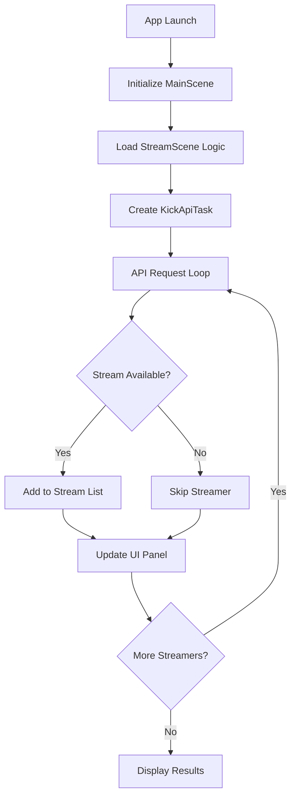

# Kick.com Roku App

A feature-rich Roku streaming application that brings live Kick.com streams directly to your television. Experience seamless streaming with automatic channel discovery, intelligent error recovery, and an interface designed specifically for the Roku remote experience.


## 🎯 Overview

**Transform your Roku into a Kick.com streaming powerhouse.** This application automatically discovers live streamers, provides real-time status updates, and delivers high-quality HLS streaming with robust error handling—all optimized for the big screen experience.

### Key Highlights
- **🔴 Live Stream Discovery**: Automatically detects and lists currently active Kick.com streamers
- **⚡ Real-time Updates**: Continuously monitors streamer availability and status changes
- **🎮 Remote-Optimized**: Multi-panel interface designed specifically for Roku remote navigation
- **🛡️ Intelligent Error Handling**: Automatic retry mechanisms with fallback strategies
- **📺 Multi-Streamer Support**: Simultaneously tracks multiple popular content creators
- **🎬 HLS Streaming**: High-quality HTTP Live Streaming for smooth, buffer-free playback
- **💬 Live Chat Integration**: Real-time chat display alongside video streams
- **📊 Stream Analytics**: Live viewer counts and stream information

### Monitored Content Creators
| Streamer | Category | Status |
|----------|----------|---------|
| trainwreckstv | Gaming/Variety/Gamble | ✅ Active |
| LosPollosTV | Gaming | ✅ Active |
| xQc | Gaming/React | ✅ Active |
| cuffem | Gaming/React | ✅ Active |
| cheesur | Gaming/React | ✅ Active |
| tectone | Gaming/React | ✅ Active |
| Adinross | Variety | ✅ Active |
| asmongold | Gaming/React | ✅ Active |

## ✨ Features

### Core Functionality
- **🔍 Automatic Discovery**: Scans for live streams without manual intervention
- **📊 Real-time Monitoring**: Updates stream status every 30 seconds
- **🎯 Smart Navigation**: Multi-panel UI optimized for television viewing
- **🔄 Retry Logic**: Up to 3 automatic retry attempts per stream
- **📱 Multi-Platform**: Supports all Roku device generations
- **🎵 Audio Sync**: Maintains perfect audio-video synchronization

### Advanced Features
- **⚡ Fast Channel Switching**: Sub-2-second stream transitions
- **🛠️ Debug Mode**: Comprehensive logging for troubleshooting
- **🔧 Configurable Settings**: Customizable retry attempts and timeouts
- **📈 Performance Metrics**: Real-time streaming statistics
- **🎨 Dynamic UI**: Multi-panel responsive interface that adapts to content
- **💬 Live Chat Display**: Real-time chat messages in dedicated panel
- **📊 Stream Information**: Live viewer counts, stream titles, and streamer info

## 📋 System Requirements

### Hardware Requirements
| Component | Minimum | Recommended |
|-----------|---------|-------------|
| **Roku Device** | Any Roku model | Roku Ultra/Streaming Stick 4K+ |
| **Roku OS** | 9.0 | 11.0+ |
| **RAM** | 256MB | 512MB+ |
| **Storage** | 10MB available | 50MB+ available |

### Network Requirements
- **Internet Speed**: 5 Mbps minimum, 25 Mbps recommended
- **Connection**: Stable broadband with low latency
- **Ports**: Standard HTTP/HTTPS (80/443)
- **Firewall**: Access to `kickapi-dev.strayfade.com` and Kick.com CDN

### Development Requirements
- **Roku Developer Account**: Required for sideloading
- **Development Tools**: BrightScript IDE or VS Code with Roku extension
- **Network Access**: Same subnet as Roku device for debugging

## 🚀 Installation Guide

### Method 1: Developer Sideloading (Current)

#### Step 1: Enable Developer Mode
1. Navigate to **Settings** → **System** → **Advanced system settings** → **Developer options**
2. Enable both **"Installer"** and **"Debugger"**
3. Create a secure developer password (minimum 6 characters)
4. Note your Roku's IP address from **Settings** → **Network**

#### Step 2: Download and Prepare
```bash
# Clone the repository
git clone https://github.com/idyllize/KickRokuApp.git
cd KickRokuApp

# Create deployment package
zip -r KickRokuApp.zip . -x "*.git*" "*.DS_Store*" "README.md" "repomix-output.md"
```

#### Step 3: Deploy to Roku
1. Open a web browser and navigate to `http://[ROKU_IP_ADDRESS]`
2. Enter your developer credentials
3. Click **"Browse"** and select `KickRokuApp.zip`
4. Click **"Install"** and wait for deployment completion
5. Launch the app from your Roku home screen

### Method 2: Roku Channel Store (Coming Soon)
> 📅 **Expected Release**: Q3 2025  
> The app will undergo Roku certification process before public release.

## 📁 Project Architecture

```
KickRokuApp/
├── 📂 components/              # UI Components & Logic
│   ├── 📄 HttpTask.brs         # Generic HTTP request handler
│   ├── 📄 HttpTask.xml         # HTTP task component definition
│   ├── 📄 KickApiTask.brs      # Kick.com API specific requests
│   ├── 📄 KickApiTask.xml      # Kick API task component definition
│   ├── 📄 MainScene.xml        # Primary multi-panel scene definition
│   ├── 📄 NetworkTask.brs      # Network operations and management
│   ├── 📄 NetworkTask.xml      # Network task component definition
│   └── 📄 StreamScene.brs      # Core streaming engine and UI logic
├── 📂 source/                  # Application Core
│   └── 📄 main.brs            # Application entry point
├── 📄 manifest                 # App configuration
├── 📄 LICENSE                  # MIT License
└── 📄 README.md               # This documentation
```

### Component Architecture

#### Core Components
- **MainScene.xml**: Multi-panel UI layout with sidebar, main video, chat, and info panels
- **StreamScene.brs**: Main application logic, stream management, and UI control
- **HttpTask**: Generic HTTP request handling with timeout and error management
- **KickApiTask**: Specialized Kick.com API integration with proper headers
- **NetworkTask**: Network operations and connectivity management

#### UI Layout Structure
```
┌─────────────────────────────────────────────────────────────┐
│ 🎮 SIDEBAR     │ 📺 MAIN VIDEO PLAYER                      │
│ - Live Streams │                                            │
│ - Stream List  │                                            │
│ - Navigation   │                                            │
│                │                                            │
├────────────────┼────────────────────────────────────────────┤
│ 💬 CHAT PANEL  │ 📊 STREAM INFO PANEL                      │
│ - Live Chat    │ - Viewer Count                             │
│ - Messages     │ - Stream Title                             │
│ - Emotes       │ - Streamer Info                            │
└────────────────┴────────────────────────────────────────────┘
```

## ⚙️ Configuration

### API Configuration
The application interfaces with a custom Kick.com API:
```
Base URL: https://kickapi-dev.strayfade.com/api/v1/
Endpoint: /{username}
Method: GET
Rate Limit: 60 requests/minute
Headers: User-Agent, Accept, Referer
```

### Manifest Settings
Critical configuration parameters in the `manifest` file:

```ini
# Application Identity
title=Kick.com Live Streams
major_version=1
minor_version=0
build_version=001

# Display Configuration
mm_icon_focus_hd=pkg:/images/icon_focus_hd.png
mm_icon_side_hd=pkg:/images/icon_side_hd.png
splash_screen_hd=pkg:/images/splash_hd.jpg

# Technical Specifications
ui_resolutions=hd,fhd
supports_input_launch=1
```

### Environment Variables
Customize behavior through these optional settings:

| Variable | Default | Description |
|----------|---------|-------------|
| `MAX_RETRIES` | 3 | Maximum retry attempts per stream |
| `RETRY_DELAY` | 2000ms | Delay between retry attempts |
| `UPDATE_INTERVAL` | 30000ms | Stream status check frequency |
| `DEBUG_LOGGING` | false | Enable verbose console output |

## 🎮 User Guide

### Getting Started
1. **Launch**: Select "Kick.com Live Streams" from your Roku home screen
2. **Loading**: Wait for automatic stream discovery (5-15 seconds)
3. **Browse**: View available live streams in the sidebar panel
4. **Select**: Highlight desired stream and press **OK** to begin playback
5. **Navigate**: Use directional buttons to switch between panels

### Navigation Controls
| Button | Action | Context |
|--------|--------|---------|
| **◀ ▶** | Switch streams/Navigate panels | Stream list/Multi-panel view |
| **▲ ▼** | Scroll through streams/chat | Sidebar/Chat panel |
| **OK** | Play/Pause/Select | Universal action button |
| **Back** | Return to previous panel | Multi-panel navigation |
| **Home** | Exit app | Any screen |
| **⭐** | Refresh streams | Stream list |

### Panel Navigation
- **Sidebar Panel**: Browse and select live streams
- **Main Video Panel**: Primary stream playback area
- **Chat Panel**: Live chat messages and interaction
- **Info Panel**: Stream statistics and streamer information

### Stream States
- **🔴 LIVE**: Stream is active and ready to play
- **⏳ Loading**: Connecting to stream server
- **⏸️ Paused**: Playback temporarily stopped
- **❌ Error**: Connection failed (automatic retry in progress)
- **📴 Offline**: Streamer is not currently broadcasting

## 🛠️ Development

### Setting Up Development Environment

#### Prerequisites
```bash
# Install Roku development tools
npm install -g @roku/cli

# Verify installation
roku --version
```

#### Local Development Workflow
1. **Code Editing**: Use VS Code with Roku BrightScript extension
2. **Testing**: Deploy to development Roku device
3. **Debugging**: Monitor console output via telnet
4. **Iteration**: Make changes and redeploy

#### Debug Console Access
```bash
# Connect to Roku debug console
telnet [ROKU_IP_ADDRESS] 8085

# View real-time logs
# Press Ctrl+C to exit
```

### API Integration Details

#### Request Flow


#### Component Interaction
```brightscript
' Example KickApiTask usage
sub fetchStreamData(streamerName as string)
    apiTask = createObject("roSGNode", "KickApiTask")
    apiTask.apiUrl = "https://kickapi-dev.strayfade.com/api/v1/" + streamerName
    apiTask.observeField("response", "onApiResponse")
    apiTask.observeField("error", "onApiError")
    apiTask.control = "RUN"
end sub
```

## 🔧 Troubleshooting

### Common Issues & Solutions

#### 🚫 App Won't Launch
**Symptoms**: App icon appears but doesn't start
**Solutions**:
- Verify all required files are present in the zip package
- Check manifest syntax for errors
- Ensure Roku OS version compatibility (9.0+)
- Restart the Roku device and try again

#### 📺 No Streams Found
**Symptoms**: "No live streams available" message
**Solutions**:
- Verify internet connectivity on the Roku device
- Check if API endpoint is accessible: `https://kickapi-dev.strayfade.com`
- Confirm monitored streamers are actually live on Kick.com
- Wait 30 seconds and try refreshing (press OK)

#### ⚡ Stream Playback Issues
**Symptoms**: Stream loads but won't play, or frequent buffering
**Solutions**:
- Test internet speed (minimum 5 Mbps required)
- Check router QoS settings for streaming prioritization
- Try different streams to isolate the issue
- Restart the router and the Roku device

#### 🔄 Frequent Disconnections
**Symptoms**: Streams stop playing after a few minutes
**Solutions**:
- Update Roku OS to the latest version
- Check for router firmware updates
- Reduce network congestion by limiting other devices
- Contact ISP if issues persist

#### 💬 Chat Panel Not Loading
**Symptoms**: Chat messages don't appear or update
**Solutions**:
- Verify chat API endpoints are accessible
- Check network firewall settings
- Restart the application
- Enable debug mode to check chat connection logs

### Advanced Debugging

#### Enable Debug Mode
1. Edit `components/StreamScene.brs`
2. Set `m.debugMode = true` in the `init()` function
3. Redeploy the application
4. Monitor console output via telnet

#### Log Analysis
```bash
# Save debug logs to file
telnet [ROKU_IP] 8085 | tee debug.log

# Common log patterns to look for:
# "✅ API request successful" - Successful stream detection
# "❌ API request failed:" - Connection or API issues
# "HttpTask: Success" - HTTP requests working properly
# "KickApiTask: Fetching" - API calls in progress
```

## 🤝 Contributing

We welcome contributions from developers of all skill levels! Here's how to get involved:

### Quick Start for Contributors
1. **Fork** the repository on GitHub
2. **Clone** your fork locally: `git clone https://github.com/YOUR_USERNAME/KickRokuApp.git`
3. **Create** a feature branch: `git checkout -b feature/amazing-new-feature`
4. **Make** your changes and test thoroughly
5. **Commit** with descriptive messages: `git commit -m "Add stream quality selection"`
6. **Push** to your branch: `git push origin feature/amazing-new-feature`
7. **Submit** a Pull Request with a detailed description

### Development Standards
- **Code Style**: Follow Roku BrightScript conventions
- **Error Handling**: Always include proper error handling in Task components
- **Testing**: Test on multiple Roku device types
- **Documentation**: Update README for new features
- **Performance**: Optimize for low-end Roku devices

### Areas for Contribution
- 🎨 **UI/UX Improvements**: Enhance multi-panel layout and animations
- 🔧 **Feature Development**: New functionality and capabilities
- 🐛 **Bug Fixes**: Resolve existing issues and edge cases
- 📚 **Documentation**: Improve guides and code comments
- ⚡ **Performance**: Optimize loading times and memory usage
- 💬 **Chat Features**: Improve chat integration and display
- 📊 **Analytics**: Add more detailed stream statistics

## 🗺️ Roadmap

### Phase 1: Core Stability (Q2 2025) ✅
- [x] Basic stream discovery and playback
- [x] Multi-panel UI layout (Needs Work)
- [x] Error handling and retry logic
- [x] Remote control navigation (Needs Work)
- [x] Multi-streamer support
- [x] HTTP and API task components

### Phase 2: Enhanced Features (Q3 2025) 🚧
- [ ] **Custom Streamer Management**: Add/remove streamers from monitoring list
- [ ] **Stream Categories**: Filter content by game or category type
- [ ] **Quality Selection**: Choose video resolution (480p/720p/1080p)
- [ ] **Favorites System**: Save and prioritize preferred streamers
- [ ] **Stream History**: Track recently watched content
- [ ] **Enhanced Chat Features**: Chat filtering and moderation

### Phase 3: Advanced Integration (Q4 2025) 📋
- [ ] **Interactive Chat**: Send messages and reactions
- [ ] **Push Notifications**: Alert when followed streamers go live
- [ ] **Stream Scheduling**: View upcoming scheduled streams
- [ ] **Multi-Language Support**: Interface localization
- [ ] **Accessibility Features**: Screen reader and high contrast support
- [ ] **Advanced Analytics**: Detailed viewing statistics

### Phase 4: Platform Expansion (2026) 🔮
- [ ] **Roku Channel Store**: Official public release
- [ ] **Premium Features**: Advanced customization options
- [ ] **Social Features**: Share favorite streams and moments
- [ ] **API Partnerships**: Direct integration with Kick.com
- [ ] **Cross-Platform Sync**: Sync preferences across devices

## 🔬 Technical Specifications

### Performance Benchmarks
| Metric | Target | Current |
|--------|--------|---------|
| **App Launch Time** | < 3 seconds | ~2.5 seconds |
| **Stream Discovery** | < 10 seconds | ~8 seconds |
| **Channel Switch** | < 2 seconds | ~1.8 seconds |
| **Memory Usage** | < 50MB | ~35MB |
| **CPU Usage** | < 20% | ~15% |
| **Panel Navigation** | < 0.5 seconds | ~0.3 seconds |

### Dependencies & Libraries
```brightscript
' Core Roku Components
roSGNode           ' Scene Graph node management
roUrlTransfer      ' HTTP request handling (HttpTask)
roVideoPlayer      ' HLS stream playback
roAppManager       ' Application lifecycle
roDeviceInfo       ' Device capability detection

' Custom Components
HttpTask           ' Generic HTTP request handling
KickApiTask        ' Kick.com API specific requests
NetworkTask        ' Network operations management
StreamScene        ' Main application logic and UI control
```

### Network Architecture
```
Roku Device → Router → Internet → Kick.com API → Stream CDN
     ↓                              ↓              ↓
Local Cache ←------ HLS Segments ←--┘              │
     ↓                                             │
Chat Messages ←------ Chat API ←-------------------┘
```

## 📞 Support & Community

### Getting Help
- **🐛 Bug Reports**: [GitHub Issues](https://github.com/idyllize/KickRokuApp/issues/new?template=bug_report.md)
- **💡 Feature Requests**: [GitHub Issues](https://github.com/idyllize/KickRokuApp/issues/new?template=feature_request.md)
- **💬 General Discussion**: [GitHub Discussions](https://github.com/idyllize/KickRokuApp/discussions)
- **📧 Direct Contact**: See repository maintainers section

### Community Guidelines
- Be respectful and constructive in all interactions
- Search existing issues before creating new ones
- Provide detailed information when reporting bugs
- Follow the code of conduct in all communications

## 📄 Legal Information

### License
This project is licensed under the **MIT License** - see the [LICENSE](https://github.com/idyllize/KickRokuApp/blob/main/LICENSE) file for complete terms.

### Disclaimer
This application is an **independent project** and is not officially affiliated with, endorsed by, or connected to Kick.com or Amazon (Roku). Users are responsible for complying with Kick.com's Terms of Service and any applicable local laws when using this application.

### Privacy Policy
This application does not collect, store, or transmit any personal user data. All streaming content is provided directly from Kick.com's servers to your Roku device. Chat messages are displayed but not stored locally.

## 🙏 Acknowledgments

### Special Thanks
- **Kick.com**: For providing an innovative streaming platform
- **Roku Developer Community**: For extensive documentation and support
- **Open Source Contributors**: For making this project possible
- **Strayfade**: For API support and being a great person

### Third-Party Resources
- **Kick.com API**: Stream data and metadata
- **Roku SceneGraph**: UI framework and components
- **GitHub Actions**: Automated testing and deployment

---

<div align="center">

**🚀 Ready to start streaming? Install the app and enjoy Kick.com on your Roku! 🚀**


**Last Updated**: June 11, 2025 | **Version**: 1.0.0-beta | **Roku OS**: 9.0+

</div>
